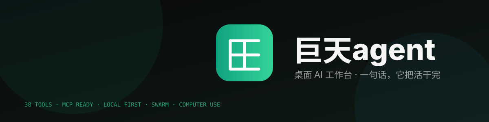

<div align="center">



**桌面 AI 工作台 · Desktop AI Workbench**

一句话，它把活干完。

[](https://github.com/deepseekv5/jutian-agent/releases)
[](https://github.com/deepseekv5/jutian-agent/releases)
[](docs/)
[](docs/)
[](./LICENSE)

**[下载最新版](https://github.com/deepseekv5/jutian-agent/releases)** · [核心亮点](#-核心亮点) · [架构](#%EF%B8%8F-架构) · [路线图](#-路线图) · [FAQ](#-faq)

</div>

---

> **⚠️ 版权声明** — 本项目为巨天工作室的版权作品，**不是开源软件**。
> 阅读、克隆即视为接受 [LICENSE](./LICENSE) 与 [COPYRIGHT.md](./COPYRIGHT.md) 之全部条款（中英双语，十八条 + 细则）。
> 未经书面授权，禁止商用、再分发、衍生开发与 AI 训练。

---

## ✨ 核心亮点

| | |
|:---|:---|
| ⚡ **说人话，它动手** | 38 个内置工具直连真实终端与文件系统。你说目标，它拆步骤、调工具、验证、给结果。不是建议，是执行。 |
| 🧩 **一切皆插件** | LY HARNESS 插件中心：38 个工具逐个开关、MCP 服务即插即用、Skills 按消息挂载。工具 schema 单一来源，桌面/手机/服务端三方同步。 |
| 👥 **集群指挥室** | 自定义数字员工，@ 接力、群聊、指定老板，自动汇总交付。员工有独立对话页与群组页。 |
| 🖥 **代码模式** | 完整开发环境：文件树、多标签、语法高亮、内置终端、**可编辑 diff**（逐改动撤销/编辑应用）、Git 检查点。 |
| 🤖 **子代理** | 主对话 AI 可自行派出**并行子代理**（并发 3），侧栏实时进度，随时可停。 |
| 🖱 **Computer Use** | 说目标，它操作这台电脑：截屏观察 → 决策 → 执行 → 验证循环，每步可打断。 |
| 📱 **手机远程** | 局域网扫码配对，手机发指令、电脑干活。配对码门卫保护全部接口，密钥不出电脑。 |
| 🔒 **本地优先** | 会话、记忆、知识库全部落在本机 SQLite。不内置任何模型服务或密钥，配置任意 OpenAI 兼容服务即可。 |

## 📊 数据一览

<div align="center">

| **38** | **5+** | **6** | **0** |
|:---:|:---:|:---:|:---:|
| 内置工具 | 数字员工 | 核心界面 | 字节上云 |

</div>

## 🚀 快速开始

```bash
git clone https://github.com/deepseekv5/jutian-agent.git
cd jutian-agent
npm install
npm start          # 开发模式 → http://localhost:3211
npm run electron:build   # 打包 macOS (dmg+zip)
```

首次使用：**设置 → 推理** 填入任意 OpenAI 兼容服务的地址、密钥与模型名。

<details>
<summary><b>📦 下载安装包</b></summary>

前往 [Releases](https://github.com/deepseekv5/jutian-agent/releases)：

| 文件 | 说明 |
|---|---|
| 巨天agent-x.x.x-arm64.dmg | macOS Apple Silicon 镜像 |
| 巨天agent-x.x.x-arm64-mac.zip | macOS 免安装包 |

> 首次打开未签名应用：右键 → 打开，或 `xattr -cr /Applications/巨天agent.app`

</details>

## 🏗️ 架构

```
┌─────────────────────────────────────────────────────┐
│                    Electron 主进程                   │
│  ┌──────────────┐  ┌──────────────────────────────┐ │
│  │  serve.cjs   │  │      窗口 / 托盘 / 截屏        │ │
│  │  38 内置工具  │  │  Computer Use / 窗口状态记忆    │ │
│  │  llm-proxy   │  └──────────────────────────────┘ │
│  │  MCP 客户端   │                                    │
│  │  定时任务     │     ┌──────────────────────┐      │
│  │  可编辑 diff │─────│    手机远程 (配对码)    │      │
│  └──────────────┘     └──────────────────────┘      │
└─────────────────────────────────────────────────────┘
         │ tools/execute          │ remote/file
         ▼                        ▼
   真实终端 · 文件系统        手机浏览器 (LAN)
```

<details>
<summary><b>📖 完整目录结构</b></summary>

```
├── index.html                 入口页面
├── serve.cjs                  后端服务（Electron 主进程内，端口 3211）
├── electron/                  主进程（窗口/托盘/Computer Use/截图/安全门卫）
├── src/
│   ├── renderer/
│   │   ├── app/               应用壳（TabBar/Sidebar/通知中心/LY HARNESS）
│   │   ├── chat/              主对话（流式/工具循环/消息分支/检查点）
│   │   ├── code/              代码模式（编辑器/终端/可编辑 diff）
│   │   ├── agents/            集群（员工面板/员工对话/群组群聊）
│   │   ├── computer/          Computer Use 标签页
│   │   ├── panels/            独立面板（文件/记忆/知识库/定时任务/…）
│   │   ├── media/             多媒体（通话/截图/PPT）
│   │   ├── settings/          设置（推理/安全/MCP/手机远程/外观）
│   │   ├── engine/            流式引擎/工具执行/子代理/代理循环
│   │   └── hooks/ store/ types/ utils/
│   └── shared/                跨端共享（工具 schema/MCP 客户端/员工/CLI）
├── docs/                      产品官网（GitHub Pages 发布源）
├── public/                    静态资源（remote.html 手机端单页）
└── scripts/                   构建/补丁/迁移脚本
```

</details>

## 🗺 路线图

- [x] 集群指挥室（员工对话/群聊/指定老板）
- [x] 子代理并行池（并发 3）
- [x] 可编辑 diff（主对话 + 代码模式）
- [x] 手机远程（配对码门卫 + 子代理 + 截图）
- [x] LY HARNESS 插件中心
- [x] screenshot 工具（主进程直采 + 多模态回喂）
- [ ] MCP SSE / streamable-http 传输
- [ ] MCP 服务级权限开关
- [ ] 定时任务 × 集群编排
- [ ] 会话模板 / 导出 PDF

## ❓ FAQ

<details>
<summary><b>首次打开提示"无法验证开发者"？</b></summary>

应用未做付费签名。右键 → 打开，或终端执行：xattr -cr /Applications/巨天agent.app
</details>

<details>
<summary><b>模型服务怎么配置？</b></summary>

设置 → 推理 → 填入任意 OpenAI 兼容服务的地址、密钥与模型名。本软件不内置任何服务与密钥。
</details>

<details>
<summary><b>我的数据安全吗？</b></summary>

会话、记忆、知识库全部存储在本机 SQLite，无遥测上报。手机远程仅限局域网且需配对码。
</details>

<details>
<summary><b>和网页版 AI 有什么区别？</b></summary>

网页版 AI 要你迁就它。桌面版直接住进你的文件、终端和工作流：读文件、跑命令、改代码、派团队——然后你验收结果。
</details>

---

<div align="center">

**巨天agent** · 桌面，是 AI 最好的位置。

[](https://github.com/deepseekv5/jutian-agent/stargazers)

**Copyright © 2026 巨天工作室. All Rights Reserved.** · 详见 [LICENSE](./LICENSE) / [COPYRIGHT.md](./COPYRIGHT.md)

</div>
